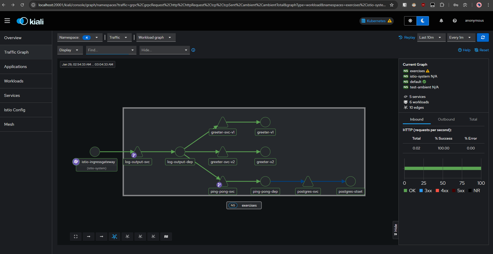

# Greeter Service

This is locally instead of the previous ones in GKE

## Build and Deploy

```bash
# Build images
docker build -t greeter:v1 --build-arg VERSION=v1 .
docker build -t greeter:v2 --build-arg VERSION=v2 .

# Import images into k3d cluster
k3d image import greeter:v1 greeter:v2 -c istio-cluster

# Apply manifests
kubectl apply -k manifests/
```

### Exercise 5.3

- Remember to apply ping_pong & log_output locally first:

```bash
# start with ping_pong directory, so move to that directory first
cd ../ping_pong

# then build and deploy
docker build -t ping-pong:latest .
k3d image import ping-pong:latest -c istio-cluster
kubectl apply -k manifests/


# then move to log_output directory
cd ../log_output

# then build and deploy
docker build -t log-output:latest .
k3d image import log-output:latest -c istio-cluster
kubectl apply -k manifests/

# back to greeter directory
cd ../greeter
```

- After that build and deploy this with the above instructions at the top ^^^

- Use Kiali `kubectl apply -f istio-1.28.3/samples/addons/kiali.yaml` (you need to have Istio installed already)
- Use Prometheus `kubectl apply -f istio-1.28.3/samples/addons/prometheus.yaml`
- Access Kiali dashboard `kubectl port-forward svc/kiali -n istio-system 20001:20001` and open `http://localhost:20001/kiali`

- May need to restart pods `kubectl rollout restart deployment/log-output-dep -n exercises`
- Pod logs `kubectl get pods -n exercises`
- Forward port with `kubectl port-forward svc/istio-ingressgateway 8080:80 -n istio-system`



## Troubleshooting

Check pod status and logs:

```bash
# Check all pods
kubectl get pods -n exercises

# Check postgres logs
kubectl logs postgres-stset-0 -n exercises -c postgres
kubectl describe pod postgres-stset-0 -n exercises

# Check PVC status
kubectl get pvc -n exercises

# Check ping-pong logs
kubectl logs -l app=ping-pong -n exercises -c ping-pong --tail=50

# Check log-output logs
kubectl logs -l app=log-output -n exercises -c log-output --tail=50

# Force delete pending pods
kubectl delete pod postgres-stset-0 -n exercises --force --grace-period=0
```
