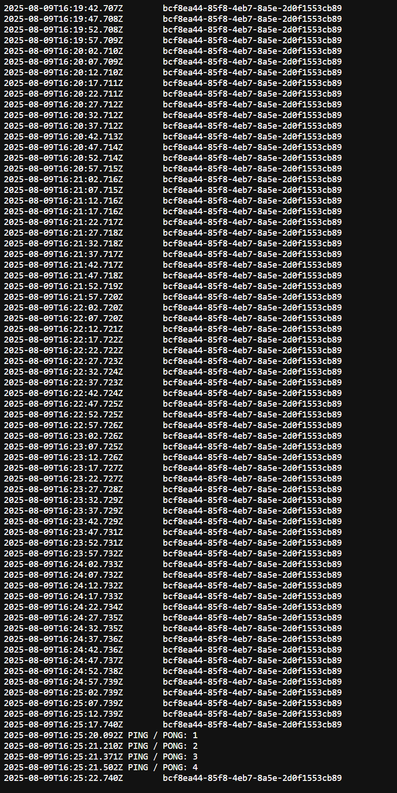
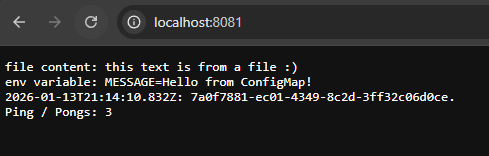
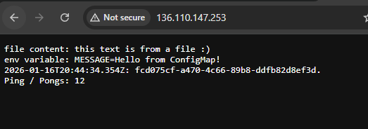
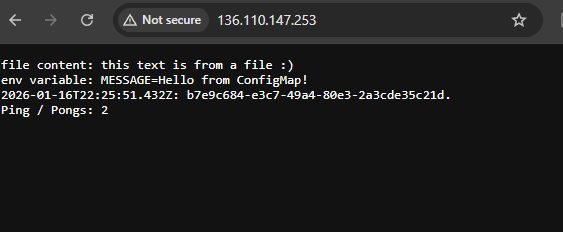
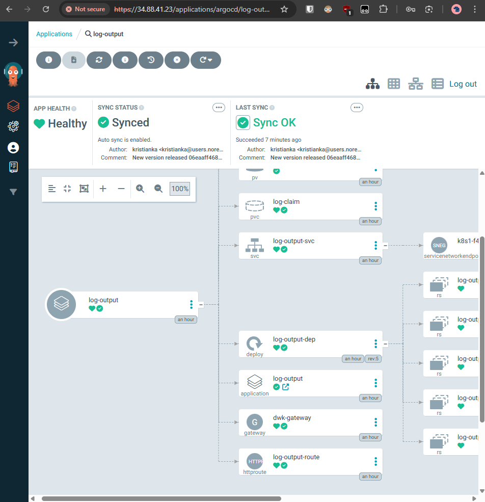

## Commands to run

### GKE Deployment

#### All-in-one command for GKE updates

- `docker build -t gcr.io/dwk-gke-484423/log-output:latest . && docker push gcr.io/dwk-gke-484423/log-output:latest && kubectl rollout restart deployment log-output-dep -n exercises`

#### Misc

- Get deployment url `kubectl get svc` or `kubectl get gateway dwk-gateway -n exercises`

### All-in-one command to restart

- `docker build --pull -t log-output . && k3d image import log-output && kubectl rollout restart deployment log-output-dep -n exercises`

- `docker build . -t log-output`
- `k3d cluster create --port 8082:30080@agent:0 -p 8081:80@loadbalancer --agents 2`
- `k3d image import log-output`
- `kubectl create deployment log-output --image=log-output`

### Edit to allow local images

- `kubectl edit deployment log-output`
- Change `imagePullPolicy` to `IfNotPresent`
- Save, then restart pod with `kubectl rollout restart deployment/log-output`

### Troubleshooting

- Is `kubectl` up and running? `k3d cluster start k3s-default`
- Show cluster info with `kubectl cluster-info`

### Logs

- Get pod names: `kubectl get pods -n exercises`
- View logs for a specific pod: `kubectl logs <pod-name> -n exercises`
- View logs for all pods in a deployment: `kubectl logs -l app=<app-name> -n exercises`
- Follow logs in real-time: `kubectl logs -f <pod-name> -n exercises`
- View logs from a specific container in a pod: `kubectl logs <pod-name> -c <container-name> -n exercises`

## Commands

### Exercise 1.7

- `docker build --pull -t log-output . && k3d image import log-output`
- `kubectl apply -f manifests`
- View the app in http://localhost:8081/

### Exercise 1.10

- If k3d breaks, just delete all the Docker containers and fully restart Docker
- Make sure you change new pod's `imagePullPolicy` (check `kubectl apply -f manifests`)
- Same steps as above

### Exercise 1.11

- `docker exec k3d-k3s-default-agent-0 mkdir -p /tmp/kube`
- Pretty much as same steps above, just for `ping_pong` app too
- (Started taking screenshots from this point on)

### Exercise 2.3

- `kubectl create namespace exercises`

### Exercise 2.5

### Exercise 3.2

### Exercise 3.3

### Exercise 4.1

- See logs `kubectl get pods -n exercises`
- See specific pod logs, e.g. `kubectl describe pod log-output-dep-56bb457b96-d9vc9 -n exercises`

### Eexercise 4.7

- `kubectl create namespace argocd`
- `kubectl apply -n argocd -f https://raw.githubusercontent.com/argoproj/argo-cd/stable/manifests/install.yaml`
- `kubectl patch svc argocd-server -n argocd -p '{"spec": {"type": "LoadBalancer"}}'`
- `kubectl get svc -n argocd`
- Setup credentials and repositories in Docker Hub

