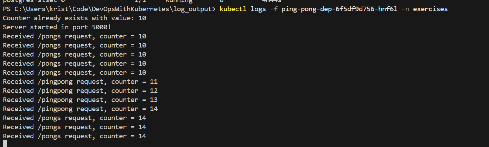
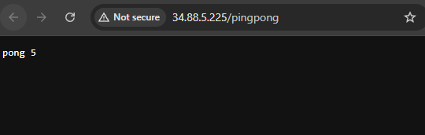

## Commands

Remember to turn off GCLOUD when not using!

### GKE Deployment

#### All-in-one command for GKE updates

- `docker build -t gcr.io/dwk-gke-484423/ping-pong:latest . && docker push gcr.io/dwk-gke-484423/ping-pong:latest && kubectl rollout restart deployment ping-pong-dep -n exercises`

### Local K3D Development

### All-in-one command to restart

- `docker build --pull -t ping-pong . && k3d image import ping-pong && kubectl rollout restart deployment ping-pong-dep -n exercises`

### Troubleshooting

- Dep missing: apply manifests `kubectl apply -f manifests/`

### Exercise 1.9

- `docker build --pull -t ping-pong . && k3d image import ping-pong`
- `kubectl apply -f manifests/`
- `cd .. cd .\log_output\`
- `kubectl apply -f manifests/`
- http://localhost:8082/pingpong

### Exercuse 1.11

- See `log_output` folder

### Exercise 2.3

- See `log_output` folder

### Exercise 2.7

### Exercise 3.1

