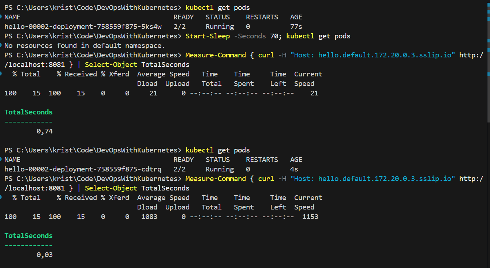

### Exercise 5.6

When pods have no traffic, they scale to zero. And when a request comes in, it scales up. Neat!

#### Set up k3d cluster with Knative Serving

- Delete old cluster `k3d cluster delete k3s-default`
- Create new one `k3d cluster create --port 8082:30080@agent:0 -p 8081:80@loadbalancer --agents 2 --k3s-arg "--disable=traefik@server:0"`

#### Install Knative Serving

- Note! Our k3d is not up-to-date, so we need to use an older version of Knative Serving

- `kubectl apply -f https://github.com/knative/serving/releases/download/knative-v1.16.1/serving-crds.yaml`
- `kubectl apply -f https://github.com/knative/serving/releases/download/knative-v1.16.1/serving-core.yaml`

#### Install network

- `kubectl apply -f https://github.com/knative-extensions/net-kourier/releases/download/knative-v1.16.0/kourier.yaml`

```powerhell
kubectl patch configmap/config-network --namespace knative-serving --type merge --patch "{`"data`":{`"ingress-class`":`"kourier.ingress.networking.knative.dev`"}}"
```

- `kubectl --namespace kourier-system get service kourier`

#### Verify install

- `kubectl get pods -n knative-serving`

#### DNS

- `kubectl apply -f https://github.com/knative/serving/releases/download/knative-v1.16.1/serving-default-domain.yaml`

#### Manifests

Of course at the end apply the manifests

- `kubectl apply -f .\manifests\`
- `curl -H "Host: hello.default.172.20.0.3.sslip.io" http://localhost:8081`

#### Results

See how it scales to zero :D Cold start only half a second


