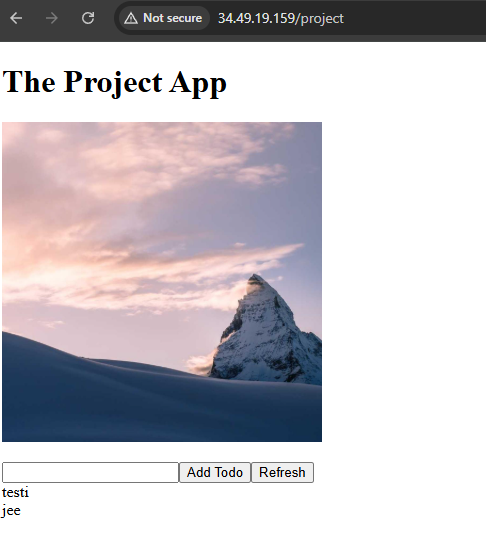
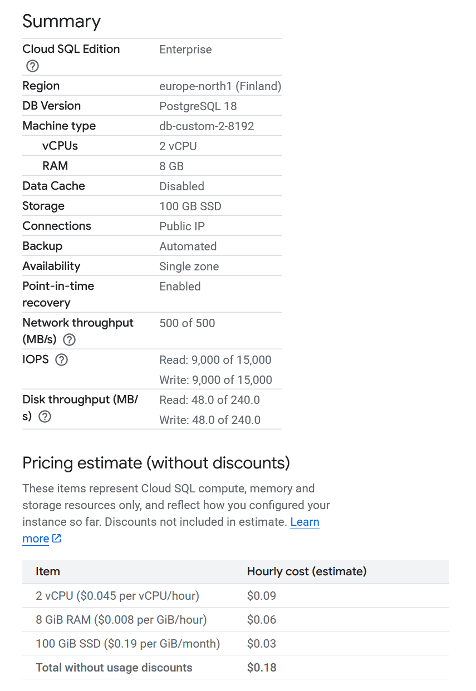

## Tech

### Why Bun?

Testing new technologies! Originally tried Deno, but couldn't get env values working. Bun seems to be pretty popular: 78.9k stars [on GitHub](https://github.com/oven-sh/bun)!

## Setup

### Bun

- https://bun.sh/
- Make sure to open this folder specifically with vs code, otherwise tsconfig won't load properly and will show errors

### Kubernetes

- Init k3d and kubectl with the steps in `log_output` folder
- `docker build --pull -t todo-server .`
- `k3d image import todo-server`
- `kubectl create deployment todo-server --image=todo-server`

## Commands

### GKE Deployment

#### All-in-one command for GKE updates

- `docker build -t gcr.io/dwk-gke-484423/todo-server:latest . && docker push gcr.io/dwk-gke-484423/todo-server:latest && kubectl rollout restart deployment todo-server-dep -n project`

### Local K3D Development

#### All-in-one command to restart

- `docker build --pull -t todo-server . && k3d image import todo-server && kubectl rollout restart deployment todo-server-dep -n project`

### Get IP where the app is running

- `kubectl get svc -n project -o wide` and `kubectl get ingress -n project`

### Exercise 1.6

- `k3d cluster delete`
- `docker build --pull -t todo-server . && k3d image import todo-server`
- `k3d cluster create --port 8082:30080@agent:0 -p 8081:80@loadbalancer --agents 2`
- `kubectl apply -f manifests/deployment.yaml`
- `kubectl apply -f .\manifests\service.yaml`
- http://localhost:8082/

### Exercise 2.4

- `kubectl create namespace project`

### Exercise 3.5

### Exercise 3.9

#### DBaaS vs DIY

It's usually cheaper to host your own database, but it comes with hassles, like managing backups. You could use Google Cloud SQL for example for easier time, but it would costs more than doing it yourself (like we are doing currently in this project).

If we create a database in Google Cloud SQL, basic Postgres database in Finland with automated backups would cost roughly $130 per month (see below image for config). It does not have the best processing power, but should be more than enough for multiple applications in the same database system. If we were to use our own system like currently in the project, it would cost only roughly couple dollars per month.

Personally, for real production apps with paying customers and critical data, I would use a managed database. The provider takes care of security, automatic updates, has easier rollbacks (point-in-time recovery), automatic failovers, and other benefits. You just drop a connection url to your env file and thats it. But on the other hand, you don't have much control of your database, and you have vendor lock-in if you want to migrate to a different cloud provider, or start hosting the apps yourself. I would use a local database for development to save on costs.

To summarise in a neat table:

| Aspect                 | DBaaS (Managed)                       | DIY (Self-hosted)                       |
| ---------------------- | ------------------------------------- | --------------------------------------- |
| **Cost**               | ~$130/month (Google Cloud SQL)        | ~$2-3/month                             |
| **Setup**              | Simple (just connection URL)          | Manual configuration required           |
| **Time to Production** | Minutes                               | Hours to days                           |
| **Security**           | Provider managed                      | Self-managed                            |
| **Updates**            | Automatic                             | Manual                                  |
| **Backups**            | Automated                             | Manual setup required                   |
| **Recovery**           | Point-in-time recovery                | Manual restoration                      |
| **Disaster Recovery**  | Built-in geo-redundancy options       | Manual planning required                |
| **Failover**           | Automatic                             | Manual setup                            |
| **Scaling**            | Easy (often zero downtime)            | Manual, potential downtime              |
| **Monitoring**         | Built-in dashboards & alerts          | Custom setup (Prometheus, Grafana, etc) |
| **SLA/Uptime**         | 99.95%+ guaranteed                    | Depends on your infrastructure          |
| **Support**            | 24/7 (on paid tiers)                  | Community or internal expertise         |
| **Expertise Required** | Minimal DB admin skills               | DBA knowledge needed                    |
| **Control**            | Limited                               | Full control                            |
| **Compliance**         | Provider certifications (SOC 2, etc.) | Self-certification required             |
| **Vendor Lock-in**     | Yes                                   | No                                      |
| **Best for**           | Production apps with critical data    | Development, cost-sensitive projects    |

### Exercise 3.10

- Create new service account, don't commit the json (I put it in gitignored `credentials` folder)
- `gcloud storage buckets create gs://dwk-project-backup --location=europe-north1`
- `kubectl create secret generic gcs-backup-secret --namespace=project --from-file=service-account-key=dwk-gke-object.json --from-literal=bucket-name=dwk-project-backup`
- Remember, not in kustomization, so manually run with `kubectl apply -f backup.yaml -n project`

### Exercise 3.12

- In Google Cloud Console: GKE -> Workloads -> `todo-server-dep` -> Container logs

