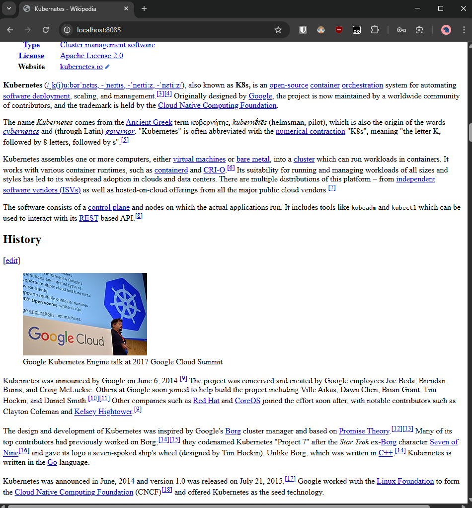
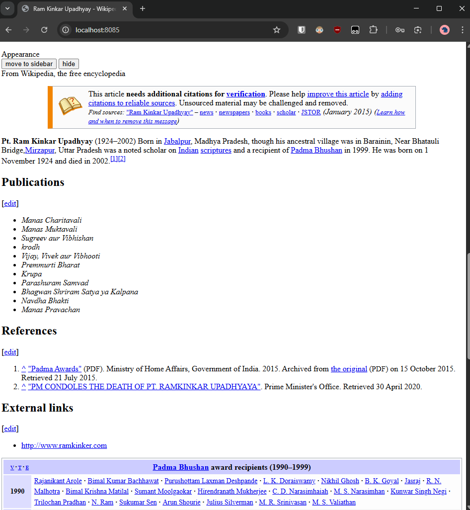

# Wikipedia Server with Sidecar

App fully works by manifest code, no Dockerfile etc! :D

### Exercise 5.4

- Apply manifests `kubectl apply -f manifests/`
- Port-forward to access locally: `kubectl port-forward service/wikipedia-server-svc 8085:80`
- Then visit http://localhost:8085

At startup

After waiting a while

